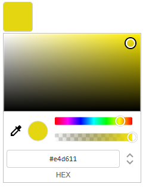
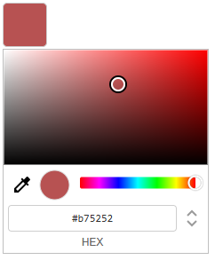

# hcg-color-picker-react

A Google Chrome style color picker — React component, lightweight, alpha support, EyeDropper API.

> **Also available as:** [Vanilla JS](https://github.com/html-code-generator/hcg-color-picker) &nbsp;·&nbsp; [Vanilla JS npm](https://www.npmjs.com/package/hcg-color-picker) &nbsp;·&nbsp; [npm package](https://www.npmjs.com/package/hcg-color-picker-react)

---

## Preview




---

## Features

- **Native React component** — no vanilla JS wrapper needed
- **Multiple instances** — each picker is fully independent, no shared state
- **Three color modes** — HEX, RGBA, HSLA
- **Alpha / opacity control** — enable or disable per instance
- **EyeDropper API** — pick any color from the screen (Chrome/Edge)
- **Touch support** — works on mobile and tablet
- **Debounce option** — built-in `debounce` prop for throttling the change event
- **Ref API** — call `setColor`, `getColor`, `open`, `close` and more from parent
- **Portal rendering** — picker renders at `document.body` level, no overflow issues

---

## Installation

```bash
npm install hcg-color-picker-react
```

---

## Import

```jsx
import ColorPicker from 'hcg-color-picker-react';
import 'hcg-color-picker-react/ColorPicker.css';
```

> `createPortal` is used internally — no extra setup needed.

---

## Basic Usage

```jsx
import ColorPicker from 'hcg-color-picker-react';
import 'hcg-color-picker-react/ColorPicker.css';

function App() {
    return (
        <ColorPicker
            color="#ff0000"
            onChange={(colors, source) => {
                console.log(colors.hex);   // "#ff0000"
                console.log(colors.rgba);  // "rgba(255, 0, 0, 1)"
                console.log(colors.hsla);  // "hsla(0, 100%, 50%, 1)"
                console.log(source);       // "drag" | "input" | "api" | "eyedropper"
            }}
        />
    );
}
```

---

## Props

| Prop        | Type       | Default     | Description                                       |
|-------------|------------|-------------|---------------------------------------------------|
| `color`     | `string`   | `'#ff0000'` | Initial color — HEX, RGB, HSL formats             |
| `onChange`  | `function` | —           | Called with `(colors, source)` every time the color changes |
| `onOpen`    | `function` | —           | Called with the current hex when the picker opens |
| `onClose`   | `function` | —           | Called with the final hex when the picker closes  |
| `alpha`     | `boolean`  | `true`      | Set to `false` to disable alpha control           |
| `debounce`  | `number`   | `0`         | ms to debounce the change event (0 = off)         |
| `disabled`  | `boolean`  | `false`     | Prevents the picker from opening                  |
| `className` | `string`   | —           | CSS class applied to the trigger button           |
| `style`     | `object`   | —           | Inline styles for the trigger button              |

---

## Color Formats

```jsx
<ColorPicker color="#ff0000" />               // 6-digit HEX
<ColorPicker color="#ff0000ff" />             // 8-digit HEX with alpha
<ColorPicker color="#f00" />                  // 3-digit HEX shorthand
<ColorPicker color="#f00a" />                 // 4-digit HEX shorthand with alpha
<ColorPicker color="rgb(255, 0, 0)" />        // RGB
<ColorPicker color="rgba(255, 0, 0, 0.5)" />  // RGBA
<ColorPicker color="hsl(0, 100%, 50%)" />     // HSL
<ColorPicker color="hsla(0, 100%, 50%, 1)" /> // HSLA
```

---

## `onChange` — callback signature

```jsx
<ColorPicker onChange={(colors, source) => { /* ... */ }} />
```

### `colors` object

```js
{
    hex:  "#ff0000",
    hexa: "#ff0000ff",
    rgb:  "rgb(255, 0, 0)",
    rgba: "rgba(255, 0, 0, 1)",
    hsl:  "hsl(0, 100%, 50%)",
    hsla: "hsla(0, 100%, 50%, 1)"
}
```

### `source` string

The second argument identifies what triggered the color change:

| Value          | Triggered by                                  |
|----------------|-----------------------------------------------|
| `"drag"`       | Dragging the color box, hue, or alpha slider  |
| `"input"`      | Typing into HEX, RGBA, or HSLA inputs         |
| `"api"`        | Calling `ref.current.setColor()` programmatically |
| `"eyedropper"` | Picking a color with the EyeDropper API       |

```jsx
<ColorPicker
    onChange={(colors, source) => {
        if (source === 'drag') { /* update live preview only */ }
        if (source === 'api')  { /* skip — we triggered this */ }
    }}
/>
```

---

## Examples

### No alpha

```jsx
<ColorPicker color="#ff0000" alpha={false} onChange={handleChange} />
```

### Debounce

Fire `onChange` only after the user stops dragging for 200ms — useful for expensive handlers like API calls or heavy re-renders:

```jsx
<ColorPicker color="#ff0000" debounce={200} onChange={handleChange} />
```

### Disabled

```jsx
<ColorPicker color="#ff0000" disabled={true} />
```

---

## Programmatic API via `ref`

Use `ref` to call methods directly from a parent component:

```jsx
import { useRef } from 'react';
import ColorPicker from 'hcg-color-picker-react';
import 'hcg-color-picker-react/ColorPicker.css';

function App() {
    const pickerRef = useRef(null);

    return (
        <div>
            <ColorPicker
                ref={pickerRef}
                color="#ff9800"
                onChange={colors => console.log(colors.hex)}
            />

            <button onClick={() => pickerRef.current.setColor('#e91e63')}>Set Pink</button>
            <button onClick={() => alert(pickerRef.current.getColor().hex)}>Get Color</button>
            <button onClick={() => pickerRef.current.open()}>Open</button>
            <button onClick={() => pickerRef.current.close()}>Close</button>
            <button onClick={() => pickerRef.current.setAlphaEnabled(false)}>Disable Alpha</button>
        </div>
    );
}
```

### Ref Methods

| Method                   | Description                              |
|--------------------------|------------------------------------------|
| `.setColor(color)`       | Programmatically set the color           |
| `.getColor()`            | Returns current color as an object       |
| `.setAlphaEnabled(bool)` | Show or hide the alpha slider at runtime |
| `.open()`                | Programmatically open the picker         |
| `.close()`               | Programmatically close the picker        |
| `.enable()`              | Enable the picker                        |
| `.disable()`             | Disable the picker                       |

### `.getColor()`

```js
pickerRef.current.getColor();
// {
//     hex:  "#ff0000",
//     hexa: "#ff0000ff",
//     rgb:  "rgb(255, 0, 0)",
//     rgba: "rgba(255, 0, 0, 1)",
//     hsl:  "hsl(0, 100%, 50%)",
//     hsla: "hsla(0, 100%, 50%, 1)"
// }

pickerRef.current.getColor().hex   // "#ff0000"
pickerRef.current.getColor().rgba  // "rgba(255, 0, 0, 1)"
pickerRef.current.getColor().hsla  // "hsla(0, 100%, 50%, 1)"
```

---

## Multiple Instances

Each `<ColorPicker>` is fully independent — no shared state:

```jsx
function App() {
    return (
        <div>
            <ColorPicker color="#f44336" onChange={c => console.log('Picker 1:', c.hex)} />
            <ColorPicker color="#4caf50" onChange={c => console.log('Picker 2:', c.hex)} />
            <ColorPicker color="#2196f3" alpha={false} onChange={c => console.log('Picker 3:', c.hex)} />
        </div>
    );
}
```

---

## TypeScript

The package ships with a bundled `index.d.ts` — no `@types/` install needed.

```tsx
import { useRef } from 'react';
import ColorPicker, {
    HcgColorSet,
    HcgColorSource,
    ColorPickerRef,
    ColorPickerProps,
} from 'hcg-color-picker-react';
import 'hcg-color-picker-react/ColorPicker.css';

function App() {
    const pickerRef = useRef<ColorPickerRef>(null);

    const handleChange = (colors: HcgColorSet, source: HcgColorSource) => {
        console.log(colors.hex);   // "#ff0000"
        console.log(colors.rgba);  // "rgba(255, 0, 0, 1)"
        console.log(source);       // "drag" | "input" | "api" | "eyedropper"
    };

    const props: ColorPickerProps = {
        color:    '#ff0000',
        alpha:    true,
        debounce: 150,
        onChange: handleChange,
    };

    return (
        <div>
            <ColorPicker ref={pickerRef} {...props} />
            <button onClick={() => pickerRef.current?.setColor('#00ff00')}>Set Green</button>
            <button onClick={() => console.log(pickerRef.current?.getColor())}>Get Color</button>
        </div>
    );
}
```

---

## Browser Support

| Feature         | Support                                     |
|-----------------|---------------------------------------------|
| Color picker UI | All modern browsers                         |
| Touch events    | iOS Safari, Android Chrome                 |
| EyeDropper API  | Chrome 95+, Edge 95+ (not Firefox / Safari) |

---

## License

MIT
